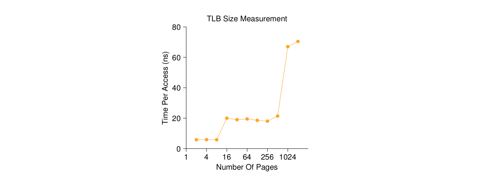
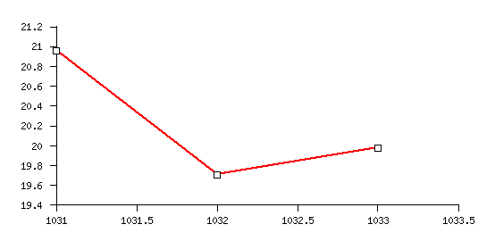

# Virtual Memory via Paging

Please review [chapters 19 and 20](http://pages.cs.wisc.edu/~remzi/OSTEP/) and
do the following exercise.

In this homework, you are to measure the size and cost of accessing a TLB. The
idea is based on work by
[Saavedra-Barrera](www.eecs.berkeley.edu/Pubs/TechRpts/1992/CSD-92-684.pdf),
who developed a simple but beautiful method to measure numerous aspects of
cache hierarchies, all with a very simple user-level program. Read his work for
more details.

The basic idea is to access some number of pages within a large data structure
(e.g., an array) and to time those accesses. For example, let’s say the TLB size
of a machine happens to be 4 (which would be very small, but useful for the
purposes of this discussion). If you write a program that touches 4 or fewer
pages, each access should be a TLB hit, and thus relatively fast. However, once
you touch 5 pages or more, repeatedly in a loop, each access will suddenly jump
in cost, to that of a TLB miss.

The basic code to loop through an array once should look like this:
```
    int jump = PAGESIZE / sizeof(int);
    for (i = 0; i < NUMPAGES * jump; i += jump) {
      a[i] += 1;
    }
```
In this loop, one integer per page of the array a is updated, up to the number
of pages specified by `NUMPAGES`. By timing such a loop repeatedly (say, a few
hundred million times in another loop around this one, or however many loops are
needed to run for a few seconds), you can time how long each access takes
(on average). By looking for jumps in cost as `NUMPAGES` increases, you can
roughly determine how big the first-level TLB is, determine whether a
second-level TLB exists (and how big it is if it does), and in general get a
good sense of how TLB hits and misses can affect performance.
The following figure shows the average time per access as the number of pages
accessed in the loop is increased. As you can see in the graph, when just a
few pages are accessed (8 or fewer), the average access time is roughly 5
nanoseconds. When 16 or more pages are accessed, there is a sudden jump to about
20 nanoseconds per access. A final jump in cost occurs at around 1024 pages, at
which point each access takes around 70 nanoseconds. From this data, we can
conclude that there is a two-level TLB hierarchy; the first is quite small
(probably holding between 8 and 16 entries); the second is larger but slower
(holding roughly 512 entries). The overall difference between hits in the
first-level TLB and misses is quite large, roughly a factor of fourteen. TLB
performance matters!



For timing, you’ll need to use a timer such as that made available by
`gettimeofday()` (see its man page for usage details). How precise is such a
timer? How long does an operation have to take in order for you to time it
precisely? (this will help determine how many times, in a loop, you’ll have to
repeat a page access in order to time it successfully)

1. Write the program, called `tlb.c`, that can roughly measure the cost of
  accessing each page. Inputs to the program should be: the number of pages to
  touch and the number of trials.
2. Now write a script in your favorite scripting language (shell, python, etc.)
  to run this program, while varying the number of pages accessed from 1 up to
  a few thousand, perhaps incrementing by a factor of two per iteration. How
  many trials are needed to get reliable measurements?
3. Next, graph the results, making a graph that looks similar to the one above.
  Use a good tool like ploticus or even zplot. Visualization usually makes the
  data much easier to digest; why do you think that is?
4. One thing to watch out for is compiler optimzation. Compilers do all sorts of
  clever things, including removing loops which increment values that no other
  part of the program subsequently uses. How can you ensure the compiler does
  not remove the main loop above from your TLB size estimator?
5. Another thing to watch out for is the fact that most systems today ship with
  multiple CPUs, and each CPU, of course, has its own TLB Time Per Access (ns)
  hierarchy. To really get good measurements, you have to run your code on just
  one CPU, instead of letting the scheduler bounce it from one CPU to the next.
  How can you do that? (hint: look up “pinning a thread” on Google for some
  clues) What will happen if you don’t do this, and the code moves from one CPU
  to the other?
6. Another issue that might arise relates to initialization. If you don’t
  initialize the array a above before accessing it, the first time you access
  it will be very expensive, due to initial access costs such as demand zeroing.
  Will this affect your code and its timing? What can you do to counterbalance
  these potential costs?

Hints:
* You can find page size with this command:
```
getconf PAGESIZE
```

* To graph the results you need to install `ploticus` as follows:
```
sudo apt-get install ploticus
```

Here is an [example](http://ploticus.sourceforge.net/doc/prefab_lines_ex.html)
on how to use `ploticus` to graph tabular data.
* Sample input in `data20`:
```
1031 20.96 6.4
1032 19.71 5.8
1033 19.98 5.9
```
* Command to generate the graph:
```
ploticus -prefab lines data=data20 x=1 y=2 png -o out.png
```
* The generated graph:


